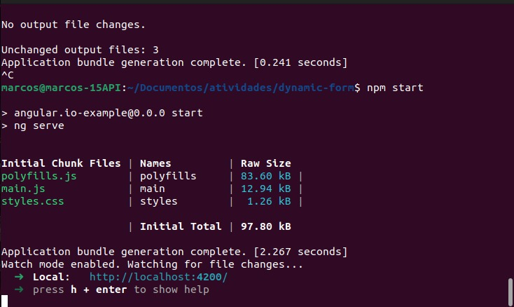
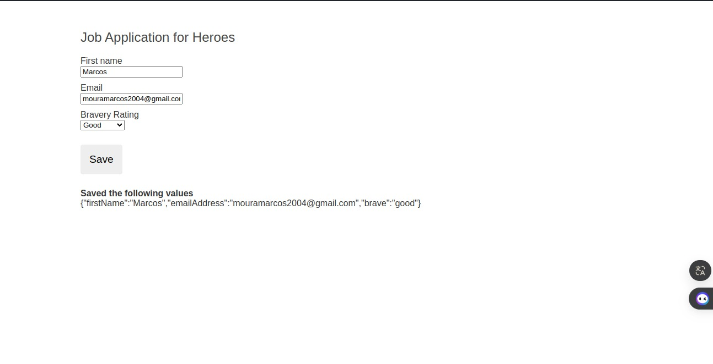
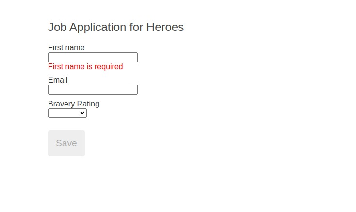

# Relatório: Construção de Formulário Dinâmico com Angular

Neste relatório, descrevo o processo de construção de um formulário dinâmico utilizando Angular, conforme solicitado na atividade.

## Introdução

Meu objetivo neste projeto foi criar um formulário dinâmico capaz de se adaptar a diferentes contextos e requisitos de negócio, utilizando Angular. O formulário apresentado foi baseado em um modelo de objeto e implementado de acordo com as diretrizes do artigo fornecido.

## Tecnologias Utilizadas

- Angular
- TypeScript
- HTML5

## Passos Realizados

1. **Configuração do Projeto**: Habilitei os formulários reativos para o projeto Angular, importando o `ReactiveFormsModule` nos componentes necessários.

2. **Construção do Modelo de Objeto de Formulário**: Criei as classes `QuestionBase`, `TextboxQuestion` e `DropdownQuestion` para representar as perguntas do formulário.

3. **Composição do Grupo de Controles do Formulário**: Implementei o serviço `QuestionControlService`, responsável por criar os grupos de controles para o formulário com base no modelo de objetos.

4. **Construção do Conteúdo do Formulário Dinâmico**: Implementei os componentes `DynamicFormComponent` e `DynamicFormQuestionComponent`, responsáveis por renderizar o formulário dinâmico com base nas perguntas e nos grupos de controles definidos anteriormente.

5. **Fornecimento de Dados**: Implementei o serviço `QuestionService` para fornecer as perguntas para o formulário.

6. **Construção do Template do Formulário Dinâmico**: Construí o template do componente `DynamicFormComponent` para exibir o formulário dinâmico.

7. **Visualização do Formulário**: No componente principal (`app.component.ts`), injetei o serviço `QuestionService` e obtive as perguntas para exibir no formulário dinâmico.

8. **Teste e Depuração**: Testei a aplicação Angular para garantir que o formulário dinâmico está funcionando corretamente.

## Capturas de Tela

A seguir estão as capturas de tela demonstrando diferentes aspectos da execução da aplicação:

### Iniciando a Aplicação

### Aplicação Funcionando

### Trava do Botão de Salvar

## Conclusão

Concluí com sucesso a construção do formulário dinâmico com Angular, seguindo os passos e diretrizes fornecidos no artigo. O formulário agora é capaz de se adaptar a diferentes contextos e requisitos de negócio de forma eficiente.
